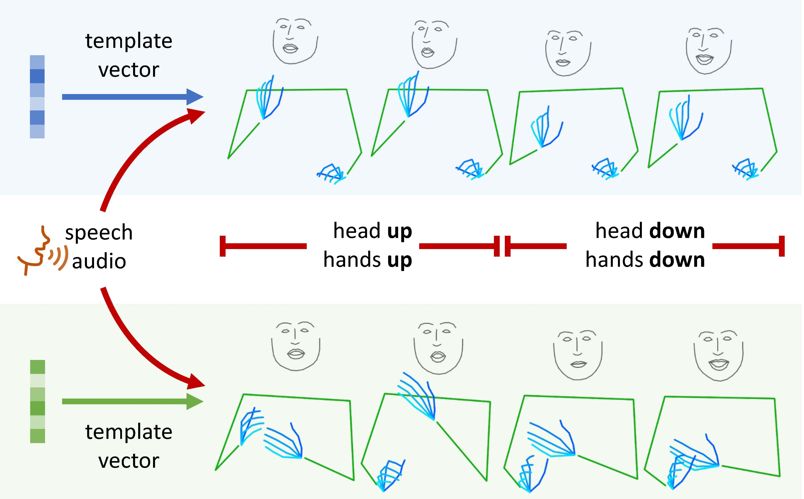

# Speech Drives Templates

The official repo for the ICCV-2021 paper "Speech Drives Templates: Co-Speech Gesture Synthesis with Learned Templates".

<p align="center">
  
</p>

Our paper and this repo focus on upper-body pose generation from audio. To synthesize images from poses, please refer to this [Pose2Img](https://github.com/zyhbili/Pose2Img) repo.

## Directory hierarchy

```
|-- config
|     |-- default.py
|     |-- voice2pose_s2g.yaml        # baseline: speech2gesture
|     |-- voice2pose_sdt_bp.yaml     # ours (Backprop)
|     |-- voice2pose_sdt_vae.yaml    # ours (VAE)
|     \-- pose2pose.yaml             # gesture reconstruction  
|
|-- core
|     |-- datasets
|     |-- netowrks
|     |-- pipelines
|     \-- utils
|
|-- datasets
|     \-- speakers
|           |-- oliver
|           |-- kubinec
|           \-- ...
|
|-- output
|     \-- <date-config-tag>  # A directory for each experiment
|
`-- main.py

```

## Installation

To generate videos, you need `ffmpeg` in your system.

```shell
sudo apt install ffmpeg
```

Install Python packages

```shell
pip install -r requirements.txt
```

## Dataset

We use a subset (Oliver and Kubinec) of the [Speech2Gesture](https://people.eecs.berkeley.edu/~shiry/projects/speech2gesture/index.html) dataset and remove frames with bad human poses. We also collect data of two mandarine speakers (Luo and Xing).

To ease later research, we pack our processed data. Please download from this [link](https://shanghaitecheducn-my.sharepoint.com/:f:/g/personal/qianshh_shanghaitech_edu_cn/EhOVnrnCYS5KqDIkamXBJbgBLOzu8vEFGwy88jSRSNATFA?e=Hc0cOO) and organize them under `datasets/speech2gesture` as the above dirctory hierarchy. Note that these packages only provide 2d human pose sequences and corresponding audio clips. For video frames, please refer to the [Speech2Gesture](https://people.eecs.berkeley.edu/~shiry/projects/speech2gesture/index.html) dataset.

Since our method address the entire upper body including the face and hands, the number of keypoints in our data is 137. For more details, please refer to [this](./pose_definition.md) document.

## Training

**Training** from scratch

``` bash
python main.py --config_file configs/voice2pose_sdt_bp.yaml \
    --tag oliver \
    DATASET.SPEAKER oliver \
    SYS.NUM_WORKERS 32
```

- `--tag` set the name of the experiment which wil be displayed in the outputfile.
- You can overwrite any parameter defined in `configs/default.py` by simply
adding it at the end of the command. The example above set `SYS.NUM_WORKERS` to 32 temporarily.

Resume **training** from an interrupted experiment

``` bash
python main.py --config_file configs/voice2pose_sdt_bp.yaml \
    --resume_from <checkpoint-to-continue-from> \
    DATASET.SPEAKER oliver
```

- With `--resume_from`, the program will load the `state_dict` from the checkpoint for both the model and the optimizer, and write results to the original directory that the checkpoint lies in.

**Training** from a pretrained model

``` bash
python main.py --config_file configs/voice2pose_sdt_bp.yaml \
    --pretrain_from <checkpoint-to-pretrain-from> \
    --tag oliver \
    DATASET.SPEAKER oliver
```

- With `--pretrain_from`, the program will only load the `state_dict` for the model, and write results to a new base directory.

## Evaluation

To **evaluate** a model, use `--test_only` and `--checkpoint` as follows

``` bash
python main.py --config_file configs/voice2pose_sdt_bp.yaml \
    --tag oliver \
    --test_only \
    --checkpoint <path-to-checkpoint> \
    DATASET.SPEAKER oliver
```

## Demo

To **evaluate** a model on an audio file, use `--demo_input` and `--checkpoint` as follows

```bash
python main.py --config_file configs/voice2pose_sdt_bp.yaml \
    --tag oliver \
    --demo_input demo_audio.wav \
    --checkpoint <path-to-checkpoint> \
    DATASET.SPEAKER oliver
```

You can find our checkpoint [here](https://shanghaitecheducn-my.sharepoint.com/:f:/g/personal/qianshh_shanghaitech_edu_cn/EhOVnrnCYS5KqDIkamXBJbgBLOzu8vEFGwy88jSRSNATFA?e=Hc0cOO).

## Pose sequence reconstruction

To compute the FTD metric, you need to first train the VAE:

```bash
python main.py --config_file configs/pose2pose.yaml \
    --tag oliver \
    DATASET.SPEAKER oliver
```

Afterwards, you can compute FTD with the pretrained VAE's encoder by spotting `VOICE2POSE.POSE_ENCODER.AE_CHECKPOINT` as follows

```bash
python main.py --config_file configs/voice2pose_sdt_bp.yaml \
    --tag oliver \
    DATASET.SPEAKER oliver \
    VOICE2POSE.POSE_ENCODER.AE_CHECKPOINT <path-to-VAE-checkpoint>
```

To use the VAE's encoding as template vectors when training, use change the config file and spot `VOICE2POSE.POSE_ENCODER.AE_CHECKPOINT` as follows

```bash
python main.py --config_file configs/voice2pose_sdt_vae.yaml \
    --tag oliver \
    DATASET.SPEAKER oliver \
    VOICE2POSE.POSE_ENCODER.AE_CHECKPOINT <path-to-VAE-checkpoint>
```

## Misc

- We save a checkpoint and conduct validation after each epoch. You can change the interval in the config file.

- We generate and save 2 videos in each epoch when training. During validation, we sample 8 videos for each epoch. These videos can be saved in tensorborad (without sound) and mp4 (with sound). You can change the `SYS.VIDEO_FORMAT` parameter to select one or two of them.

- For multi-GPU training, we recommand using DistributedDataParallel (DDP) because it provide SyncBN across GPU cards. To enable DDP, set `SYS.DISTRIBUTED` to `True` and set `SYS.WORLD_SIZE` according to the number of GPUs.
    > When using DDP, assure that the `batch_size` can be divided exactly by `SYS.WORLD_SIZE`.

- We usually set `NUM_WORKERS` to 32 for best performance. If you encounter any error about memory, try lower `NUM_WORKERS`.


- We also support dataset caching (`DATASET.CACHING`) to further speed up data loading.
    > If you encounter errors in the dataloader like `RuntimeError: received 0 items of ancdata`, please increase `ulimit` by running the command `ulimit -n 262144`. (refer to this [issue](https://github.com/pytorch/pytorch/issues/973))

- To run any module other than the main files in the root directory, for example the `core\datasets\speech2gesture.py` file, you should run `python -m core.datasets.speech2gesture` rather than `python core\datasets\speech2gesture.py`. This is an interesting problem of Python's relative importing.


```
@inproceedings{qian2021speech,
  title={Speech Drives Templates: Co-Speech Gesture Synthesis with Learned Templates},
  author={Qian, Shenhan and Tu, Zhi and Zhi, YiHao and Liu, Wen and Gao, Shenghua},
  journal={International Conference on Computer Vision (ICCV)},
  year={2021}
}
```
