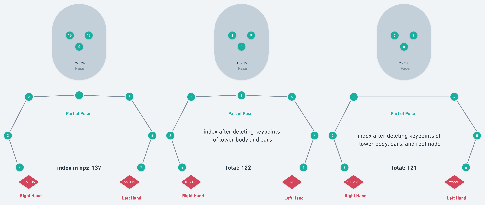

# Pose Definition

## 137 Keypoints in our processed data

The 2d keypoints are predicted by [OpenPose](https://github.com/CMU-Perceptual-Computing-Lab/openpose/blob/master/doc/02_output.md). We combine the keypoints of body(BODY_25), face(70), left hand(21), and right hand(21) sequentially and get 137 keypoints, which are stored in the `npz` files of our processed data.

## 121 points in our dataloader

For our model, we delete keypoints of ears and the lower body in our dataloader, keeping 122 points. Afterwards, we center all the keypoints by the neck (keypoint #1) and leave the neck point out. Therefore, our model output the xy-coordinate of 121 keypoints.

This process is illustrated as follows



```python
# npz-137
  0->7      (8->14)    15->16    (17->24)     25->94     95->115      116-136
Upper_body   legs       eyes     ears&feet     face     left_hand    right_hand


# 137-15=122
## note that we set #1 point as the root node
  0->7      ( - )       8->9      ( - )       10->79     80->100      101-121
Upper_body   legs       eyes     ears&feet     face     left_hand    right_hand


# 122-1=121
## Since we expect the root node to be 0, we remove it.
  0->6      ( - )       7->8      ( - )       9->78     79->99      100-120

Upper_body   legs       eyes     ears&feet     face     left_hand    right_hand
```

Here is a code snippet to conduct the process:

```python
def pose137_to_pose121(x):
    return np.concatenate([
            x[:, :, 0], x[:, :, 2:8],  # upper_body
            x[:, :, 15:17],  # eyes
            x[:, :, 25:]  # face, hand_l and hand_r
        ], axis=-1)   
```

## Hierarchical pose representation

In addition to the #1 point as the global root node, we use #4 and #7 as the local root node for right-hand points and left-hand points, #40(#30 on the head) as the local root node for face points, respectively.

Here is a code snippet to conduct the process:

```python
# indices in 121 points
root_node = 1
hand_root_l = 6
hand_root_r = 3
head_root = 39

def absolute_to_relative_parted(poses):
    poses[:, :2, :] -= poses[:, :2, root_node, None]

    # remove root node (122 -> 121)
    indices = [0] + list(range(2,122))
    poses = poses[:, :, indices]

    # local relative head poses
    poses[:, :2, 9:head_root] -= poses[:, :2, head_root, None]
    poses[:, :2, head_root+1:79] -= poses[:, :2, head_root, None]
    
    # local relative hand poses
    poses[:, :2, 79:100] -= poses[:, :2, hand_root_l, None]
    poses[:, :2, 100:121] -= poses[:, :2, hand_root_r, None]
```